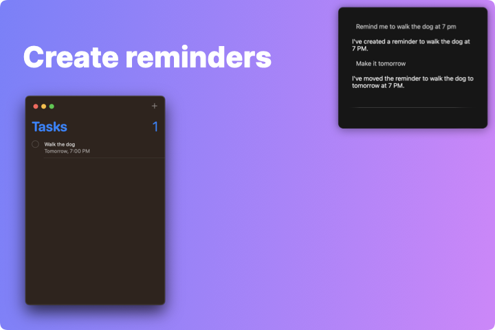

# April

Replace your voice assistant with April, a GPT4-powered virtual assistant capable of executing scripts to serve user requests. Ask April to find and manipulate files, adjust the volume and brightness, or remind you to get milk during your next grocery run. 

## Capabilities

- [x] Generate and execute Python scripts to serve user requests
  - [x] Automatically install missing packages via pip into a venv
- [x] Search Google and browse websites to obtain answers
- [x] Display informational cards for the user
- [x] Open files and folders
- [x] Open apps
- [x] Integration with reminders
- [ ] Integration with calendar
- [ ] Play songs
- [ ] Send text message
- [ ] Send email

## Warning

Executing scripts from the Internet is very dangerous! April allows you to set a "risk threshold", where you will be asked for your confirmation before running scripts rated above the set threshold. Set the threshold to zero to be asked every time. 
